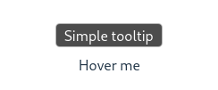

# 💬 Toolpop

💬 **Toolpop** is a lightweight Vue 3 `v-pop` directive for reactive tooltips and simple HTML/image popovers.

[DEMO](https://toolpop.jsonkody.cz) | [Live Demo on StackBlitz](https://stackblitz.com/github/JsonKody/toolpop_demo?file=src%2FApp.vue)

## 🔥 Quick Usage

Drop it into your Vue template easily:

```html

<p v-pop="'Simple tooltip'">Hover me</p>


<button v-pop="`Count: ${count}`" @click="count++">Click me</button>


<button v-pop.click.html="'<strong>Bold</strong> text'">Click me</button>


<button v-pop:bottom-start="'Aligned to start'">Bottom Start</button>
```



✨🎨 **Fully customizable** tooltip appearance with extensive styling options!

- 🎁 **tiny - only 1 dependency:** [@floating-ui/dom](https://www.npmjs.com/package/@floating-ui/dom) [(web)](https://floating-ui.com)
- ✨ Auto-flipping + positioning with `top`, `bottom-start`, `right-end`, etc.
- ⚡ Supports reactive values, `ref`, `computed`, functions
- - 🚀 **Zero-lag HTML Popovers:** `.html` tooltips are pre-rendered and kept in the DOM, making images and complex content appear instantly without network or render lag.
- 🧩 Optional HTML/image mode via `.html`

---

## 🚀 Installation & Setup

with **pnpm**:
```sh
pnpm add toolpop
```
with **npm**:
```sh
npm install toolpop
```

### 🧩 Use as Plugin
```ts
// main.ts
import Toolpop from 'toolpop'

// Registers v-pop globally with default options
app.use(Toolpop)

// Or register with custom options
// (See the "Options" section below for the full list of available properties):
app.use(Toolpop, { 
  color: 'red', 
  fontSize: 16 
})
```

### ✒️ Use as Directive
```ts
// main.ts
import { createPop } from 'toolpop'

// Registers v-pop globally
app.directive('pop', createPop()) // name "pop" whatever you want
```

---

## ⚙️ Props & Modifiers

### Placements (Props)
You can control the placement using directive arguments (e.g., `v-pop:right`):

| Placement | Description | Example |
| :--- | :--- | :--- |
| **`:top`** | Above the element (Default) | `v-pop="'Text'"` |
| **`:bottom`, `:left`, `:right`** | Centered on the specified side | `v-pop:bottom="'Text'"` |
| **`-start`** suffix | Aligns tooltip to the start of the element | `v-pop:top-start="'Text'"` |
| **`-end`** suffix | Aligns tooltip to the end of the element | `v-pop:right-end="'Text'"` |

### Behavior Modifiers
- **`.html`** – interpret value as raw HTML (e.g., images or rich markup). 
  *⚡ **Performance Note:** To guarantee instant responsiveness, `.html` popovers are pre-rendered upon component mount and persistently kept in the DOM (hidden via CSS). This eliminates layout shifts and prevents network lag when hovering over elements with images.*
- **`.click`** – shows the tooltip on click instead of hover
- **`.leave`** – hides the tooltip on mouseleave (only useful with `.click`)

---

## ✏️ Options

```ts
interface PopOptions {
  fontSize: number
  paddingX: number
  paddingY: number
  duration: number
  fontFamily: string
  color: string
  backgroundColor: string
  borderColor: string
  borderRadius: number
  scaleStart: number
  blur: number
}
```

For typed custom options when registering the directive manually:
```ts
import { createPop, type PopOptions } from 'toolpop'

const options: Partial<PopOptions> = {
  fontSize: 28,
  paddingX: 15,
  paddingY: 4,
  blur: 0,
  backgroundColor: 'rgba(0, 0, 0, 0.1)',
}

app.directive('pop', createPop(options))
```

---

## 📁 Local use (optional)

Copy `src/pop.ts` into your project and register locally:
```ts
import { createPop } from '@/directives/pop' // path where you put it ...
app.directive('pop', createPop())
```

---

## 🌍 Live Projects
- [jsonkody.cz](https://jsonkody.cz)
- [num.jsonkody.cz](https://num.jsonkody.cz)
- [snejk.bekinka.cz](https://snejk.bekinka.cz)

---

## 🪪 License
[MIT](https://github.com/jsonkody/toolpop/blob/main/LICENSE) © 2026 [JsonKody](https://github.com/jsonkody)
